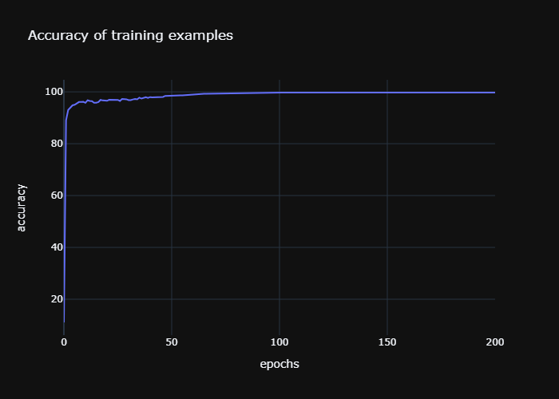
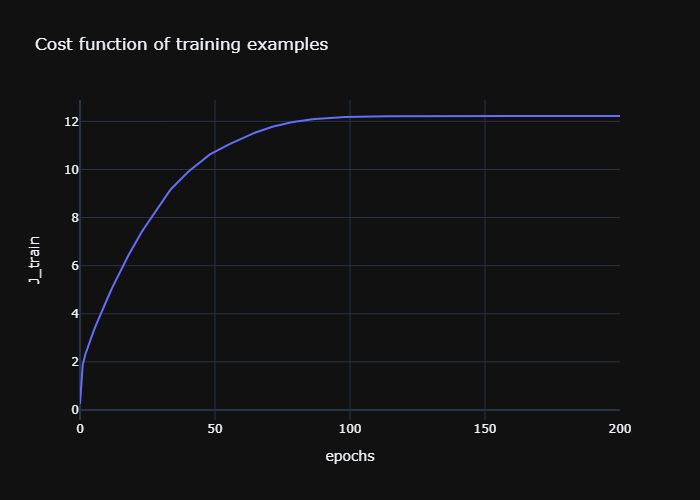

# ***Model 1***

Here is the summary of a trained model for the MNIST dataset.

## **1. Model Design**
## This model is consisted of *3* layers

Layer 1:
Layer 1 is consisted of *25* neurons.

so the shape of its *Weights and Biases* are:

- Weights = (784, 25)

- Biases = (1, 25)

Layer 2:
Layer 2 is consisted of *15* neurons.

so the shape of its *Weights and Biases* are:

- Weights = (25, 15)

- Biases = (1, 15)

Layer 3:
Layer 3 is consisted of *10* neurons.

so the shape of its *Weights and Biases* are:

- Weights = (15, 10)

- Biases = (1, 10)

The total parameters of this model = 20175
## **3. Model's Hyperparametes**
- ### Model's hyperparameters are:

                Batch size (mini batch): 256 training examples

                Learning rate (alpha): 0.03

                Learning rate decay: 0.0005

                Regularization term -L2 regularization- (lambda): 15.0

                Gradient descent with momentum hyperparameter (beta 1): 0.9

                RMSprop hyperparameter (beta 2): 0.999

## **3. Model's Accuracy**
- ### Model's accuracy of the training examples:                99.992

- ### Model's accuracy of the cross validating examples:                95.69

- ### Model's accuracy of the testing examples:                95.89

## **4. Model's Losses**
- ### Model's losses of the training examples: 16.241944566222802

- ### Model's losses of the cross validating examples: 16.284708489930647

- ### Model's losses of the testing examples: 16.282937702844336

## **5. Model's Executed time**
- ### The executed time: 8 minutes,,             6 seconds ,,                 848.21 milli seconds, along 200 epochs

